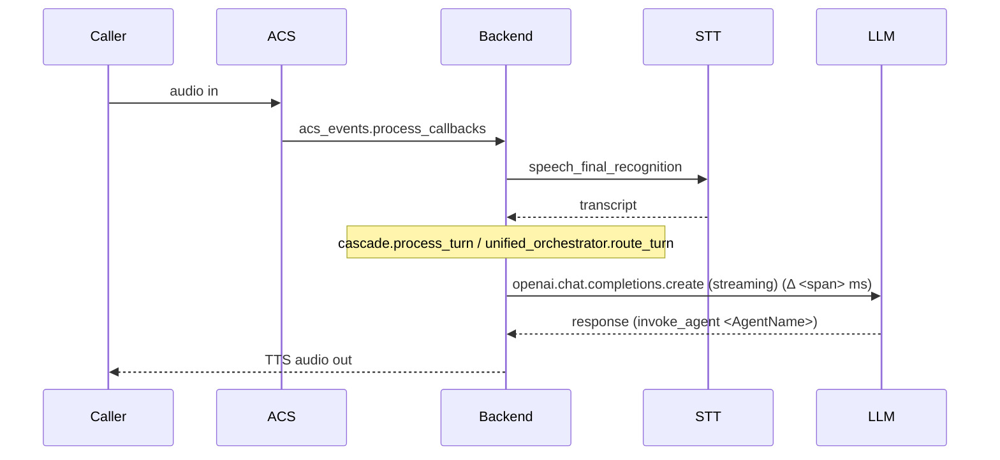

# Observability Insights Skill

Use this skill to pull the **wider context** of a deployed deployment together and turn it into
something readable: where the resources are, what the traces say, and a visual of how a call
actually flowed. Pairs with the `troubleshoot` skill — that one isolates a layer, this one
shows the system around it.

> **🧭 Golden rule:** Observe and visualize, don't mutate. Every command here is read-only.

---

## 🚧 Guardrails

**You MUST NOT**:

- ❌ Run anything that creates, updates, scales, restarts, or deletes resources
- ❌ Run `azd env set`, `az ... create/update/delete`, `terraform apply`, redeploys
- ❌ Invoke any **MCP tool with a write side-effect** (creating issues, mutating/scaling/restarting
  resources) — including "scan" tools whose options default to writing; set them to read-only
- ❌ Print full connection strings / instrumentation keys — mask them
- ❌ Invent resource names, workspace IDs, or KQL columns — confirm them from artifacts first

**You MUST**:

- ✅ Use only read verbs: `get`, `list`, `show`, `query`, `logs show`
- ✅ **Source the deployment context** from local azd artifacts, or **ask the user** to provide it
- ✅ Probe for the missing identifier (env name, resource group, app insights name) instead of guessing
- ✅ Label every chart/diagram with the time window and the query it came from

---

## Step 0 — Locate the deployment context (ask if unclear)

Don't assume which deployment you're looking at. Resolve it from local artifacts first:

```bash
# Which azd environments exist locally?
azd env list

# Pull the resolved values for one (the source of truth for resource names)
azd env select <env>
azd env get-values | sed -E 's/(accesskey|key|password|secret|ConnectionString)=[^;"]*/\1=***/gi'
```

Useful keys that usually come out of `azd env get-values`:

- `AZURE_RESOURCE_GROUP` / `AZURE_LOCATION` / `AZURE_SUBSCRIPTION_ID`
- `BACKEND_CONTAINER_APP_FQDN`
- `APPLICATIONINSIGHTS_CONNECTION_STRING` (App Insights — mask it)
- Log Analytics workspace name/id (if exported)

**If there is no local azd env** (someone else deployed it, or you're on a clean clone), ask the user for:

1. The **resource group** (or subscription + RG)
2. The **Application Insights resource name** (or its App ID)
3. The **time window** of the problem (e.g. "around 14:32 UTC today")
4. A **`call_id` / correlation id** if they have one

Then confirm the resources exist before querying:

```bash
az monitor app-insights component show -g <rg> -a <appinsights-name> -o table
az containerapp list -g <rg> -o table
```

---

## Azure MCP (preferred when connected)

If an **Azure MCP** is wired into this workspace, prefer its tools over hand-rolled CLI for
both **resource discovery** and **log/telemetry lookup** — they resolve the deployed topology
for you. Confirm availability first; if none is connected, use the `az`/KQL commands below.

| Capability | MCP path | Notes |
| --- | --- | --- |
| ARTagent deployment health | SRE-agent `check_deployment_health` (`environment`, `include_metrics`) | One-shot, read-only |
| App Insights logs by service | SRE-agent `analyze_deployment_logs` (`service`, `severity`, `time_range`) | Read-only |
| STT/TTS pool utilization | SRE-agent `analyze_pool_metrics` (`time_range`, `alert_threshold`) | Read-only |
| Resource lookup / list | Generic Azure MCP — **read** ops only (`get`/`list`/`show`) | Find RG, App Insights, Container Apps |
| Ad-hoc KQL against App Insights | Generic Azure MCP `app_insights` query op (`app_insights_name`, `query`, `timespan`) | Same KQL as below |

> **⚠️ Write guardrail:** never call MCP operations that create/update/delete resources, scale,
> restart, or file issues (e.g. a security-scan tool whose `auto_create_issues` defaults to `true`
> — set it to `false`). This skill observes only. Hand any required change back to the user.

When using a generic Azure MCP `app_insights` query op, pass the **same KQL** from the library
below and a bounded `timespan` (e.g. `PT1H`).

---

## KQL query library

Run these via the App Insights extension (read-only) **or** the Azure MCP `app_insights` query op.
Always pass a bounded time window.

```bash
az monitor app-insights query \
  -g <rg> -a <appinsights-name> \
  --analytics-query "<KQL below>" \
  --offset 1h -o table
```

The app instruments OpenTelemetry spans. These names/attributes are **verified against live
telemetry** — span names are emitted as `dependencies` rows (`name` column), attributes live in
`customDimensions`:

| Layer | Span `name` | Key `customDimensions` |
| --- | --- | --- |
| LLM | `openai.chat.completions.create (streaming)` | `gen_ai.request.model`, `gen_ai.request.max_tokens`, `gen_ai.request.temperature`, `gen_ai.streaming`, `gen_ai.endpoint_type`, `dependency.type` (`Azure OpenAI`) |
| STT | `speech_partial_recognition`, `speech_final_recognition` | (event markers; duration ~0) |
| Turn (cascade) | `cascade.process_turn`, `route_turn_thread.process_speech` | `call.connection.id`, `session.id`, `cascade.agent`, `cascade.turn`, `cascade.handoff_executed`, `cascade.user_text_len`, `cascade.response_text_len` |
| Turn (router) | `unified_orchestrator.route_turn` | `call.connection.id`, `session.id` |
| Agent | `invoke_agent <AgentName>` (e.g. `invoke_agent BankingConcierge`) | per-agent |
| VoiceLive | `voicelive.connect`, `voicelive.handler.start`, `voicelive.agent.apply_session`, `voicelive.connection.close` | session attrs |
| ACS | `acs_events.process_callbacks`, `call_event_processor.process_events` | call attrs |
| State | `Redis.*` (`Redis.PUBLISH`/`HGETALL`/...), `cosmosdb.find`, `cosmosdb.upsert` | — |
| Startup | `startup.*` (`startup.aoai`, `startup.speech`, `startup.agents`, ...) | — |

> **Correlation key:** join a call by `customDimensions['call.connection.id']` (ACS) or
> `customDimensions['session.id']` (browser), or by `operation_Id`. There is **no** `call_id` field.
> **No token-usage dimension is exported** (`gen_ai.usage.*` / `aoai.*_tokens` do not exist) — use
> latency and throttle counts for the LLM, not token counts.

> ℹ️ Confirm the names for *your* deployment first — VoiceLive vs SpeechCascade mode and version
> changes affect which spans appear. Probe with the "distinct names" query below before relying on one.

**Distinct span names present (run this first)**
```kql
dependencies
| where timestamp > ago(7d)
| summarize c=count() by name
| order by c desc
```

**Recent failures (exclude internet scanner noise)**
```kql
union requests, dependencies, exceptions
| where timestamp > ago(1h)
| where success == false or itemType == "exception"
| where name !in ("GET /", "GET /mdcscanner", "GET /AzMonSDKDynamicConfigurationChanges")
| project timestamp, itemType, name, resultCode, problemId=tostring(details), operation_Id
| order by timestamp desc
| take 50
```

**Latency percentiles per operation (find the slow layer)**
```kql
dependencies
| where timestamp > ago(1h)
| summarize p50=percentile(duration,50), p95=percentile(duration,95),
            p99=percentile(duration,99), count() by name
| order by p95 desc
```

**Everything for one call (the timeline)**
```kql
union requests, dependencies, traces, exceptions
| where operation_Id == "<operation id>"
   or customDimensions["call.connection.id"] == "<acs-call-connection-id>"
   or customDimensions["session.id"] == "<browser-session-id>"
| project timestamp, itemType, name, duration, resultCode, message
| order by timestamp asc
```

**Azure OpenAI latency / throttle view** (no token dimension is exported)
```kql
dependencies
| where timestamp > ago(6h)
| where name startswith "openai.chat.completions"
| summarize calls=count(), throttles=countif(resultCode == "429"),
            failures=countif(success == false),
            model=any(tostring(customDimensions["gen_ai.request.model"])),
            p50ms=percentile(duration,50), p95ms=percentile(duration,95) by name
```

---

## Visualizations to produce

Render findings as artifacts the user can read at a glance. Always caption with the time window
and source query.

### 1. Call flow (mermaid sequence) — reconstruct from the per-call timeline



### 2. Latency waterfall — turn the percentile/timeline rows into a per-stage bar table

| Stage | Span | p50 | p95 | Note |
| --- | --- | --- | --- | --- |
| STT final | `speech_final_recognition` | … | … | event marker (~0ms span) |
| LLM call | `openai.chat.completions.create (streaming)` | … | … | LLM round-trip |
| Full turn (cascade) | `cascade.process_turn` | … | … | STT→LLM→tools→TTS aggregate |
| Full turn (router) | `unified_orchestrator.route_turn` | … | … | end-to-end routed turn |

Per-component latency targets (STT < 200ms, LLM first token < 500ms, TTS first chunk < 150ms)
come from `system-architecture.instructions.md` → Performance Constraints. Note the per-turn spans
above are **aggregate** (whole turn), so compare them to the ~1s end-to-end turn target, not the
per-component budgets.

### 3. Component health snapshot — fold `/api/v1/readiness` + `dependencies` failures into a RAG table

| Component | Status | Evidence |
| --- | --- | --- |
| Redis | 🟢/🟡/🔴 | readiness check + `Redis.*` dependency errors |
| Azure OpenAI | … | `openai.chat.completions.*` 429/failure count, p95 |
| Speech (STT/TTS) | … | `speech_*` error rate |
| ACS | … | `acs_events.*` / `call_event_processor.*` failures |
| Cosmos DB | … | `cosmosdb.find` / `cosmosdb.upsert` failures |

---

## How to use it

1. **Resolve context** (Step 0) — env, RG, App Insights, time window. Ask if any are missing.
2. **Scope the query** to the reported window and the call key (`call.connection.id` / `session.id` / `operation_Id`); never run unbounded queries.
3. **Pull the timeline + percentiles**, identify the stage that breaks the latency budget.
4. **Render** the call sequence + waterfall, captioned with the source query and window.
5. Hand the slow/failing stage back to the **`troubleshoot`** skill for root-causing.

---

## Reference

- Telemetry setup: `utils/telemetry_config.py` (App Insights / OpenTelemetry, PII scrubbing)
- Health endpoints: `apps/artagent/backend/api/v1/endpoints/health.py`
- Performance targets: `.github/instructions/system-architecture.instructions.md`
- Azure MCP tools (when connected): SRE-agent `check_deployment_health` / `analyze_deployment_logs` / `analyze_pool_metrics`; generic Azure MCP read + `app_insights` KQL
- Layer isolation: `troubleshoot` skill
- Deploy artifacts & hooks: `deployment-guide` skill
